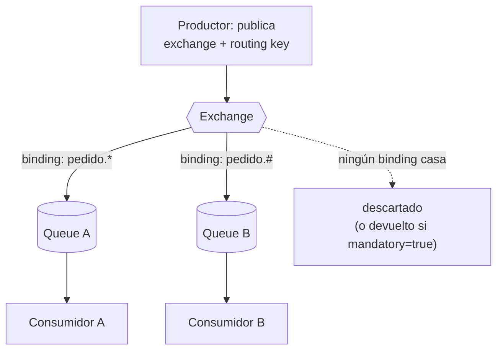
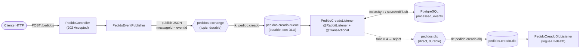
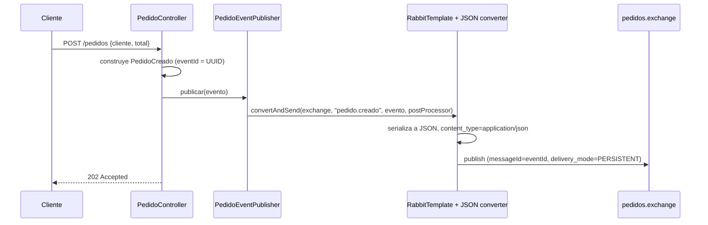
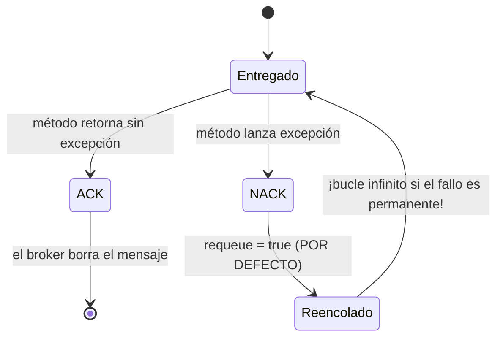
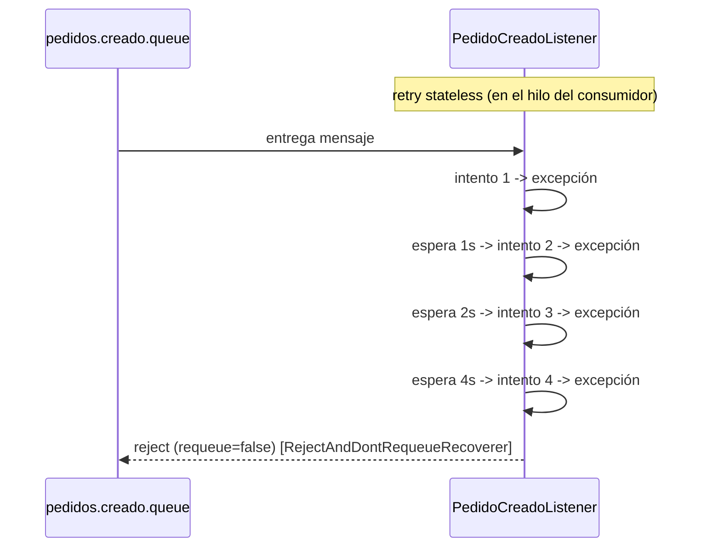
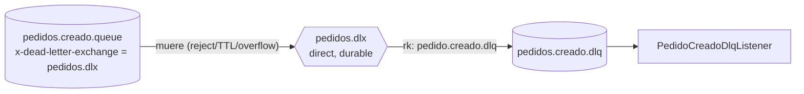
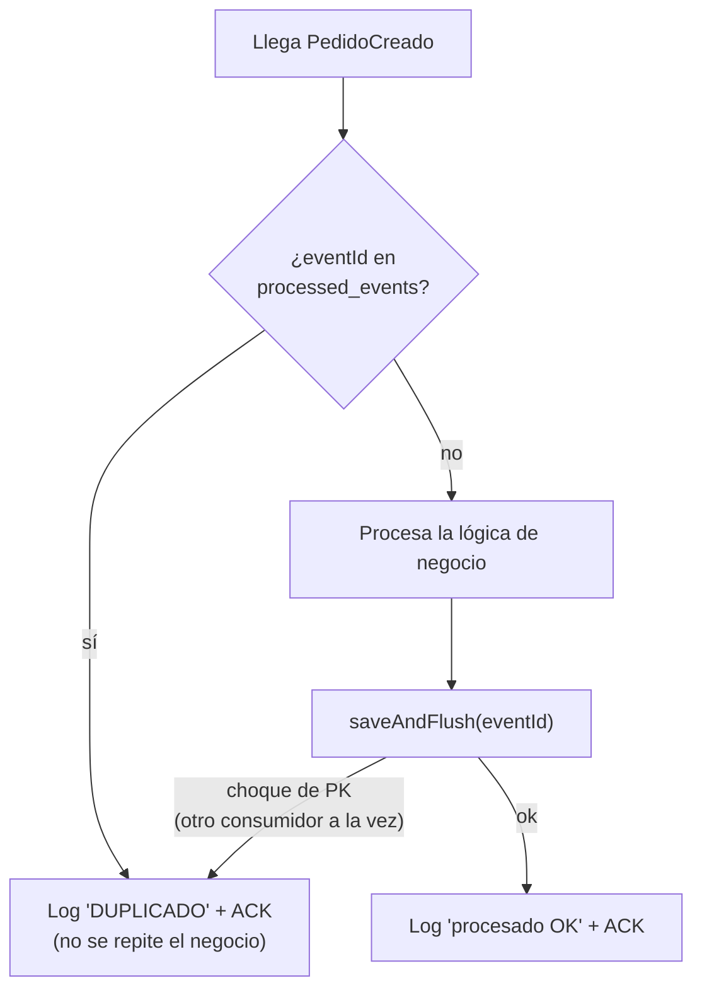
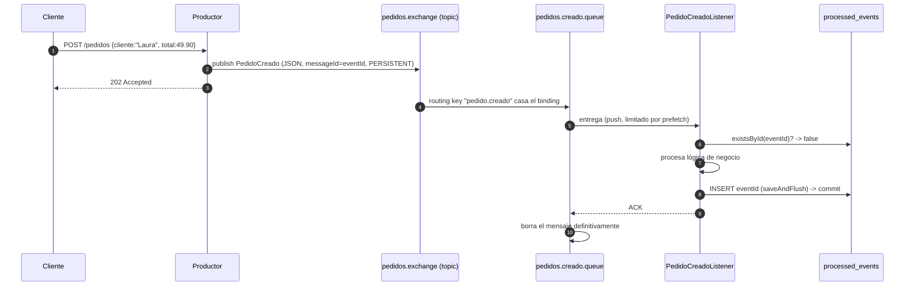
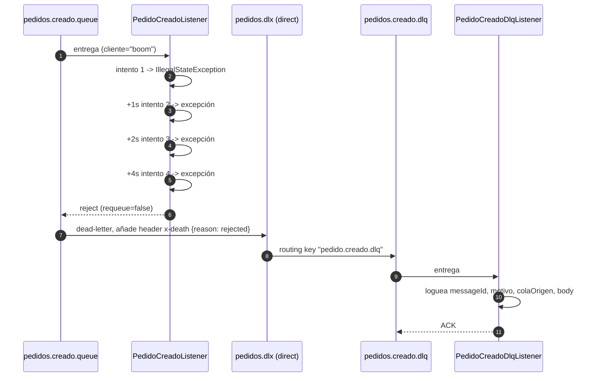
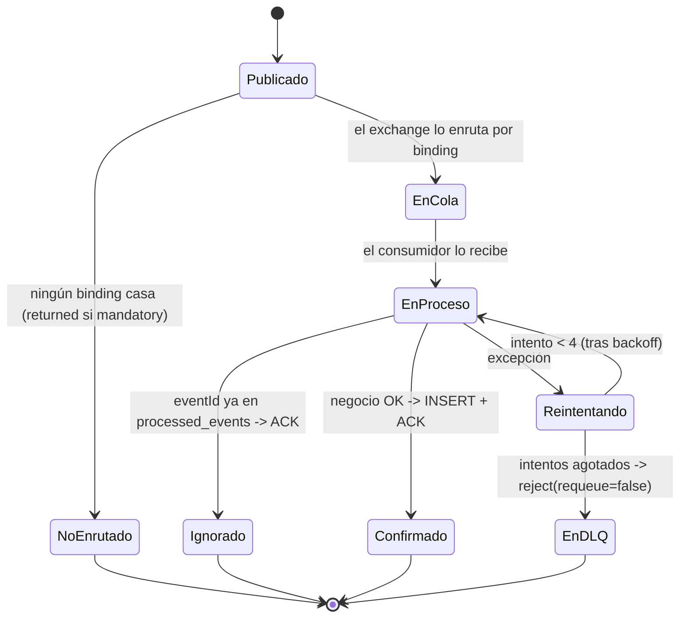

# Mensajería con RabbitMQ + Spring Boot — proyecto de práctica

Flujo práctico de mensajería asíncrona construido **paso a paso** para preparar entrevistas
técnicas de backend. Un evento de dominio simple (`PedidoCreado`) que un **productor**
publica y un **consumidor** procesa, con reintentos, *Dead-Letter Queue* e idempotencia.

**Stack:** Java 21 · Spring Boot 3.5 · Spring AMQP · RabbitMQ 4 · PostgreSQL 16 · Docker Compose · Maven

---

## Índice

1. [Objetivo](#objetivo)
2. [Conceptos de RabbitMQ en 2 minutos](#conceptos-de-rabbitmq-en-2-minutos)
3. [Arquitectura](#arquitectura)
4. [Estructura del proyecto](#estructura-del-proyecto)
5. [Puesta en marcha](#puesta-en-marcha)
6. [Los 6 bloques, explicados](#los-6-bloques-explicados)
   - [1. Broker con Docker Compose](#1-broker-con-docker-compose)
   - [2. Productor](#2-productor)
   - [3. Consumidor con @RabbitListener](#3-consumidor-con-rabbitlistener)
   - [4. Reintentos con backoff exponencial](#4-reintentos-con-backoff-exponencial)
   - [5. Dead-Letter Queue (DLQ)](#5-dead-letter-queue-dlq)
   - [6. Idempotencia](#6-idempotencia)
7. [El viaje completo de un mensaje](#el-viaje-completo-de-un-mensaje)
8. [Topología creada en el broker](#topología-creada-en-el-broker)
9. [Configuración de referencia](#configuración-de-referencia)
10. [Comandos útiles](#comandos-útiles)
11. [Problemas típicos (troubleshooting)](#problemas-típicos-troubleshooting)
12. [Cheat-sheet de entrevista](#cheat-sheet-de-entrevista)
13. [Mejoras futuras](#mejoras-futuras)

---

## Objetivo

Poder **dibujar en una pizarra** el flujo completo de un evento de dominio a través de un
broker de mensajería y **defender cada decisión**:

- Por qué se publica a un *exchange* y no a una cola.
- Qué diferencia hay entre *durabilidad* y *persistencia*.
- Cómo funciona el modelo de *ACK* y por qué el requeue por defecto es peligroso.
- Cómo se implementan reintentos con *backoff* y dónde ocurren realmente.
- Para qué sirve una *Dead-Letter Queue* y cómo se configura.
- Por qué la *idempotencia* es responsabilidad del consumidor y cómo se garantiza.

---

## Conceptos de RabbitMQ en 2 minutos

| Término | Qué es | Analogía (oficina de correos) |
|---|---|---|
| **Productor** | Publica mensajes. No sabe quién los consume. | Tú, que echas una carta. |
| **Exchange** | Punto de entrada. Recibe el mensaje y decide a qué cola(s) va. **No almacena.** | La ventanilla de correos. |
| **Routing key** | Etiqueta que el productor pone al mensaje. | La dirección escrita en el sobre. |
| **Binding** | Regla que une un exchange con una cola (con un patrón de routing key). | "Las cartas para esta zona van a este buzón". |
| **Queue** | Buzón. Almacena el mensaje hasta que un consumidor lo confirma (ACK). | El buzón físico. |
| **Consumidor** | Lee mensajes de una cola y los procesa. | El vecino que abre el buzón. |

### Tipos de exchange

| Tipo | Enruta según | Uso típico |
|---|---|---|
| `direct` | routing key **exacta** | Enrutar por una clave concreta (p. ej. una DLQ por evento). |
| `topic` | **patrón** sobre la routing key: `*` = una palabra, `#` = cero o más | Varios eventos (`pedido.creado`, `pedido.cancelado`) y consumidores selectivos. |
| `fanout` | a **todas** las colas ligadas (ignora la routing key) | Broadcast. |
| `headers` | por headers del mensaje | Enrutado complejo sin routing key. |

Este proyecto usa **`topic`** para el flujo principal y **`direct`** para el *dead-lettering*.



---

## Arquitectura



Todo corre en local: RabbitMQ y PostgreSQL en contenedores Docker; la app Spring Boot
como proceso Java que se conecta a `localhost`.

---

## Estructura del proyecto

```
Rabbit/
├── docker-compose.yml                 # RabbitMQ + PostgreSQL
├── pom.xml                            # Maven: amqp, web, data-jpa, postgresql
├── README.md
└── src/main/
    ├── resources/
    │   └── application.yml            # conexión, reintentos, datasource
    └── java/com/example/rabbit/
        ├── RabbitApplication.java     # main
        ├── config/
        │   └── RabbitConfig.java      # exchange, colas, bindings, DLX/DLQ, converter JSON
        ├── domain/
        │   └── PedidoCreado.java      # el evento de dominio (record inmutable)
        ├── api/
        │   └── PedidoController.java  # POST /pedidos -> publica el evento
        ├── producer/
        │   └── PedidoEventPublisher.java
        ├── consumer/
        │   ├── PedidoCreadoListener.java      # consumidor principal (+ idempotencia)
        │   └── PedidoCreadoDlqListener.java   # consumidor de la DLQ
        └── idempotency/
            ├── ProcessedEvent.java             # @Entity -> tabla processed_events
            └── ProcessedEventRepository.java   # JpaRepository
```

---

## Puesta en marcha

### Requisitos

- Docker Desktop en marcha
- JDK 21+
- Maven (o el wrapper `mvnw`)

### 1. Levantar la infraestructura

```bash
docker compose up -d
docker compose ps        # rabbitmq y postgres deben quedar "healthy"
```

- UI de RabbitMQ: <http://localhost:15672> — usuario `app` / `app`
- PostgreSQL: `localhost:5433`, base `pedidos`, `app` / `app`
  *(5433 en el host porque el 5432 puede estar ocupado por otro proyecto; dentro del contenedor sigue siendo 5432)*

### 2. Arrancar la aplicación

```bash
mvn spring-boot:run
```

Al arrancar, Spring:
- declara en el broker el exchange, las colas y los bindings (vía `RabbitAdmin`);
- crea la tabla `processed_events` en PostgreSQL (Hibernate `ddl-auto: update`).

Queda escuchando en <http://localhost:8080>.

> **Importante:** cada vez que cambies código o `application.yml`, **para y vuelve a arrancar** la app.

### 3. Enviar un pedido

```bash
curl -X POST http://localhost:8080/pedidos \
  -H "Content-Type: application/json" \
  -d '{"cliente":"Laura","total":49.90}'
```

En PowerShell:

```powershell
Invoke-RestMethod -Uri http://localhost:8080/pedidos -Method Post `
  -ContentType 'application/json' -Body '{"cliente":"Laura","total":49.90}'
```

Respuesta: `202 Accepted` + `{ "status": "accepted", "eventId": "...", "pedidoId": "..." }`.

---

## Los 6 bloques, explicados

### 1. Broker con Docker Compose

**Problema que resuelve:** tener un RabbitMQ reproducible en segundos, con su UI de administración.

**Cómo:** `docker-compose.yml` levanta `rabbitmq:4-management` (variante *con* panel web y API HTTP)
y `postgres:16`.

| Elemento | Para qué |
|---|---|
| Puerto `5672` | Protocolo **AMQP 0-9-1**: por aquí hablan productor y consumidor. |
| Puerto `15672` | UI / API de administración: inspeccionar exchanges, colas, mensajes, bindings. |
| `RABBITMQ_DEFAULT_USER/PASS` | Usuario propio. El usuario `guest` solo conecta desde `localhost` *dentro* del contenedor. |
| `volumes: rabbitmq_data` | Persiste definiciones (colas durables) y mensajes persistentes entre recreaciones. |
| `healthcheck` | Docker sabe cuándo el broker está *realmente* listo (no solo "proceso arrancado"). |

**Puntos de entrevista:**
- La imagen `-management` trae el plugin de administración ya activado.
- El volumen es lo que separa "perder los mensajes al recrear el contenedor" de "no perderlos".

---

### 2. Productor

**Problema que resuelve:** publicar un evento de dominio sin conocer ni esperar al consumidor.

**Flujo:**



**Piezas:**

| Clase | Responsabilidad |
|---|---|
| `PedidoCreado` (record) | Evento inmutable. `eventId` = UUID **del evento** (≠ `pedidoId`). Base de la idempotencia. |
| `RabbitConfig#pedidosExchange` | Declara `TopicExchange` **durable**. |
| `RabbitConfig#jsonMessageConverter` | `Jackson2JsonMessageConverter` reutilizando el `ObjectMapper` de Spring Boot (soporta `Instant`). |
| `RabbitConfig#rabbitTemplate` | Cliente de publicación + `returnsCallback` que loguea mensajes no enrutables. |
| `PedidoEventPublisher` | `convertAndSend(...)` + post-processor: `messageId=eventId`, `delivery_mode=PERSISTENT`. |
| `PedidoController` | `POST /pedidos` → construye y publica. Devuelve **202 Accepted** (procesado asíncrono). |

**Detalle:** `spring.rabbitmq.template.mandatory: true` hace que un mensaje **no enrutable**
sea **devuelto** al productor (y logueado) en vez de descartado en silencio. Si publicas
antes de que exista la cola/binding, verás `WARN ... NO_ROUTE`: es la prueba de que el
mensaje llegó al exchange.

**Puntos de entrevista:**
- El productor publica a un **exchange**, nunca directo a una cola.
- `202 Accepted` comunica que la petición se aceptó pero el trabajo es asíncrono.
- `messageId = eventId` viaja en las *properties* AMQP y se reutiliza aguas abajo para deduplicar.
- En un sistema real, primero se persiste el pedido y **luego** se publica (patrón *outbox*).

---

### 3. Consumidor con @RabbitListener

**Problema que resuelve:** recibir el evento, deserializarlo y procesarlo, de forma desacoplada del productor.

**Piezas:**

| Bean | Qué hace |
|---|---|
| `pedidoCreadoQueue` | `Queue` **durable**. La declara **quien consume**, no el productor. |
| `pedidoCreadoBinding` | Une `pedidos.exchange` → `pedidos.creado.queue` con routing key exacta `pedido.creado`. |
| `PedidoCreadoListener#onPedidoCreado` | `@RabbitListener(queues = ...)`. Spring deserializa el JSON a `PedidoCreado` (mismo converter) e invoca el método. |

**Modelo de ACK (clave):**



Ese **requeue infinito** ante un fallo permanente (bug, JSON corrupto) es el motivo del bloque 4.

**Puntos de entrevista:**
- Quien consume declara su cola; el productor no sabe qué colas existen.
- ACK por defecto = `AUTO`: ack al retornar, nack al excepcionar.
- Mientras un mensaje está *unacked*, el broker no lo borra; si el consumidor muere, lo reentrega.
- **Prefetch** (`spring.rabbitmq.listener.simple.prefetch`): cuántos mensajes sin ack se envían a un consumidor a la vez. Bajo = reparto equitativo; alto = más throughput.

---

### 4. Reintentos con backoff exponencial

**Problema que resuelve:** un fallo **transitorio** (BD saturada, servicio caído un segundo)
no debería mandar el mensaje directo al descarte, ni reintentarse en bucle instantáneo.

**Cómo:** bloque `spring.rabbitmq.listener.simple.retry` en `application.yml`.

| Propiedad | Valor | Efecto |
|---|---|---|
| `retry.enabled` | `true` | Activa reintentos automáticos al excepcionar el listener. |
| `retry.max-attempts` | `4` | 1 intento inicial + 3 reintentos. |
| `retry.initial-interval` | `1s` | Espera antes del 1.er reintento. |
| `retry.multiplier` | `2` | Cada espera ×2 → **1 s, 2 s, 4 s**. |
| `retry.max-interval` | `10s` | Tope de espera entre reintentos. |
| `default-requeue-rejected` | `false` | Al agotar reintentos, **NO** devolver a la cola → se acabó el bucle. |

**Flujo:**



**Fallo simulado para probarlo:** en `PedidoCreadoListener`, si `cliente == "boom"` se lanza
una `IllegalStateException` siempre.

```bash
curl -X POST http://localhost:8080/pedidos -H "Content-Type: application/json" \
  -d '{"cliente":"boom","total":10}'
```

En los logs verás la línea `Procesando PedidoCreado ... cliente=boom` **4 veces**, con
marcas de tiempo separadas ~1 s, ~2 s, ~4 s, y al final `Retries exhausted`.

**Puntos de entrevista:**
- El retry *stateless* de Spring ocurre **en el hilo del consumidor** (`Thread.sleep` por debajo),
  **no** en el broker. Ventaja: simple. Inconvenientes: ese hilo queda ocupado durante las
  pausas; si la app reinicia a mitad, el contador se reinicia.
- Alternativa "de producción": reintentos gestionados por el broker con **colas de espera + TTL**
  (retry vía DLX), que no bloquean al consumidor.
- El *backoff exponencial* da tiempo a que un recurso saturado se recupere sin martillearlo.

---

### 5. Dead-Letter Queue (DLQ)

**Problema que resuelve:** cuando un mensaje agota los reintentos, **no perderlo**. Apartarlo
en una cola separada para inspeccionarlo, alertar o reprocesarlo.

**Mecanismo:** a la cola principal se le añaden dos **argumentos**:

| Argumento | Valor | Significado |
|---|---|---|
| `x-dead-letter-exchange` | `pedidos.dlx` | A qué exchange reenviar un mensaje cuando "muere". |
| `x-dead-letter-routing-key` | `pedido.creado.dlq` | Con qué routing key reenviarlo. |

Un mensaje **"muere" (dead-letters)** cuando:
1. se **rechaza sin requeue** (nuestro caso, al agotar reintentos);
2. **caduca por TTL**;
3. la **cola está llena** (`x-max-length`).

**Topología:**



**Piezas:** `RabbitConfig` declara `pedidosDlx` (`DirectExchange`), `pedidoCreadoDlq` (`Queue`)
y `pedidoCreadoDlqBinding`. `PedidoCreadoDlqListener` consume la DLQ recibiendo el `Message`
**crudo** (sin deserializar: un mensaje puede estar aquí justamente porque su JSON era inválido)
y loguea el header **`x-death`**.

Ejemplo de log al mandar un `boom`:

```
=== MENSAJE EN DLQ === messageId=0ff1... motivo=rejected colaOrigen=pedidos.creado.queue vecesMuerto=1
  body={"eventId":"0ff1...","cliente":"boom","total":10,"ocurridoEn":"..."}
```

**Puntos de entrevista:**
- La DLQ se configura con **argumentos de cola**; cambiarlos exige **borrar y recrear** la cola
  (RabbitMQ rechaza redeclarar con argumentos distintos → `PRECONDITION_FAILED`).
- Un `direct` DLX permite tener **una DLQ por evento** colgando del mismo exchange.
- El header `x-death` es un array con `count`, `reason`, `queue`, `time`, `exchange`,
  `routing-keys` — oro puro para depurar.
- Alternativa a los argumentos en código: una **policy** en el broker (`rabbitmqctl set_policy`).

---

### 6. Idempotencia

**Problema que resuelve:** RabbitMQ garantiza entrega **at-least-once** → un mensaje **puede
llegar más de una vez**:
- el consumidor procesa pero **muere antes del ACK** → el broker reentrega;
- se corta la red → redelivery;
- el productor reintenta su publicación.

Si el procesamiento tiene efectos secundarios (cobrar, enviar email, descontar stock),
ejecutarlo dos veces es un **bug grave**.

**Solución:** tabla `processed_events` con el **`eventId` como clave primaria**.



Todo dentro de **`@Transactional`** (una transacción de BD):

- si la **lógica de negocio falla** → *rollback* → el `eventId` **no** queda registrado →
  los reintentos (y, si se agotan, la DLQ) siguen teniendo sentido;
- si todo va bien → se confirma la fila y el contenedor hace **ACK** del mensaje.

> El ACK a RabbitMQ ocurre **después** de que el método retorne, **fuera** de la transacción
> de BD. Si el proceso muere entre el *commit* y el ACK, el mensaje se reentrega — pero la
> fila en `processed_events` ya existe y el chequeo lo frena. **Justo para eso existe la tabla.**

**Prueba:** el `PedidoController` acepta un `eventId` opcional. Envía el mismo dos veces:

```bash
BODY='{"eventId":"aaaa0000-0000-0000-0000-000000000001","cliente":"Laura","total":49.90}'
curl -X POST http://localhost:8080/pedidos -H "Content-Type: application/json" -d "$BODY"
curl -X POST http://localhost:8080/pedidos -H "Content-Type: application/json" -d "$BODY"
```

- 1.ª vez → `Procesando... eventId=aaaa0000-...` → `PedidoCreado procesado OK`
- 2.ª vez → `Evento DUPLICADO, se ignora. eventId=aaaa0000-...`

```bash
docker exec postgres psql -U app -d pedidos -c "select * from processed_events;"
# -> una sola fila
```

**Puntos de entrevista:**
- La **barrera real** contra duplicados es la **clave primaria** de `processed_events`, no el
  `if existsById(...)`. Ese `if` es un atajo rápido; con consumidores concurrentes, el segundo
  `saveAndFlush` revienta con violación de integridad y ahí se captura.
- `saveAndFlush` (en vez de `save`) fuerza el `INSERT` **dentro** del `try`, para poder cazar
  el choque de PK antes del *commit*.
- Chequeo + negocio + registro deben ir en **la misma transacción**.
- `ddl-auto: update` es solo para practicar; en producción, migraciones con **Flyway/Liquibase**.
- Alternativa/《complemento》: *deduplication* en el propio broker con plugins, o claves de
  idempotencia con TTL en Redis si el volumen es muy alto.

---

## El viaje completo de un mensaje

### Caso feliz



### Caso fallo → reintentos → DLQ



### Estados posibles de un mensaje



---

## Topología creada en el broker

La declara Spring al arrancar (beans en `RabbitConfig`).

| Recurso | Tipo | Durable | Detalles |
|---|---|---|---|
| `pedidos.exchange` | exchange `topic` | sí | Entrada del flujo principal. |
| `pedidos.creado.queue` | queue | sí | `x-dead-letter-exchange=pedidos.dlx`, `x-dead-letter-routing-key=pedido.creado.dlq` |
| binding | — | — | `pedidos.exchange` → `pedidos.creado.queue`, rk `pedido.creado` |
| `pedidos.dlx` | exchange `direct` | sí | Exchange de mensajes muertos. |
| `pedidos.creado.dlq` | queue | sí | Almacén de eventos no procesables. |
| binding | — | — | `pedidos.dlx` → `pedidos.creado.dlq`, rk `pedido.creado.dlq` |

Tabla en PostgreSQL:

| Tabla | Columnas | Clave |
|---|---|---|
| `processed_events` | `event_id VARCHAR(64)`, `processed_at TIMESTAMP` | PK = `event_id` |

---

## Configuración de referencia

`src/main/resources/application.yml`:

| Propiedad | Valor | Para qué |
|---|---|---|
| `spring.rabbitmq.host` / `port` | `localhost` / `5672` | Conexión AMQP. |
| `spring.rabbitmq.username` / `password` | `app` / `app` | Credenciales del broker. |
| `spring.rabbitmq.template.mandatory` | `true` | Devolver mensajes no enrutables (no descartarlos en silencio). |
| `spring.rabbitmq.listener.simple.acknowledge-mode` | `auto` | ACK al retornar, NACK al excepcionar. |
| `spring.rabbitmq.listener.simple.default-requeue-rejected` | `false` | No reencolar tras agotar reintentos. |
| `spring.rabbitmq.listener.simple.retry.*` | ver [bloque 4](#4-reintentos-con-backoff-exponencial) | Backoff exponencial + tope de intentos. |
| `spring.datasource.url` | `jdbc:postgresql://localhost:5433/pedidos` | PostgreSQL (5433 en el host). |
| `spring.jpa.hibernate.ddl-auto` | `update` | Crea `processed_events` al arrancar (solo práctica). |
| `spring.jpa.open-in-view` | `false` | Buena práctica: no mantener la sesión JPA abierta en la capa web. |
| `app.messaging.*` | nombres | Exchange, colas y routing keys parametrizados. |

---

## Comandos útiles

### RabbitMQ

```bash
# Listar colas con nº de mensajes
docker exec rabbitmq rabbitmqctl list_queues name messages messages_ready messages_unacknowledged

# Ver argumentos de una cola (p. ej. la DLX configurada)
docker exec rabbitmq rabbitmqctl list_queues name arguments

# Borrar una cola (necesario si cambian sus argumentos)
docker exec rabbitmq rabbitmqctl delete_queue pedidos.creado.queue

# Ver bindings
docker exec rabbitmq rabbitmqctl list_bindings
```

### PostgreSQL

```bash
docker exec postgres psql -U app -d pedidos -c "\dt"
docker exec postgres psql -U app -d pedidos -c "select * from processed_events order by processed_at desc;"
docker exec postgres psql -U app -d pedidos -c "truncate processed_events;"   # resetear idempotencia
```

### Enviar pedidos

```bash
# Normal
curl -X POST http://localhost:8080/pedidos -H "Content-Type: application/json" \
  -d '{"cliente":"Laura","total":49.90}'

# Que falla -> reintentos -> DLQ
curl -X POST http://localhost:8080/pedidos -H "Content-Type: application/json" \
  -d '{"cliente":"boom","total":10}'

# Mismo eventId dos veces -> idempotencia
curl -X POST http://localhost:8080/pedidos -H "Content-Type: application/json" \
  -d '{"eventId":"fixed-1","cliente":"Laura","total":49.90}'
```

---

## Problemas típicos (troubleshooting)

| Síntoma | Causa | Solución |
|---|---|---|
| `WARN ... NO_ROUTE` al publicar | No hay cola/binding que case la routing key | Normal antes de arrancar el consumidor; si persiste, revisa el binding. |
| `PRECONDITION_FAILED - inequivalent arg 'x-dead-letter-exchange'` | La cola ya existe en el broker con argumentos distintos (RabbitMQ no deja "modificarla") | `rabbitmqctl delete_queue pedidos.creado.queue` y reinicia la app. |
| `FatalListenerStartupException: Mismatched queues` | Igual que el anterior, detectado por el contenedor del listener | Borrar la cola y reiniciar. |
| `Bind for 0.0.0.0:5432 failed: port is already allocated` | Otro contenedor/servicio usa el 5432 | Este proyecto ya mapea `5433:5432`; ajusta si también lo tienes ocupado. |
| Cambios en el código que "no hacen nada" | La app sigue corriendo con la versión anterior | Parar (`Ctrl+C`) y volver a `mvn spring-boot:run`. |
| El mensaje `boom` no va a la DLQ | La app arrancó sin el bloque `retry` o sin `default-requeue-rejected: false` | Revisa `application.yml` y reinicia. |

---

## Cheat-sheet de entrevista

- **Exchange vs. cola:** el productor publica a un *exchange* (enruta, no almacena); el *binding*
  lo conecta a una *cola* (almacena hasta ACK).
- **Topic exchange:** enruta por patrón (`*` = una palabra, `#` = cero o más). Permite añadir
  eventos y consumidores selectivos sin tocar el productor.
- **Durabilidad vs. persistencia:** cola *durable* (sobrevive su definición) + mensaje
  *persistente* (`delivery_mode=2`, se escribe a disco). Hacen falta **las dos**.
- **ACK:** retorno normal → ACK; excepción → NACK. El requeue por defecto es infinito e
  inmediato → hay que desactivarlo (`default-requeue-rejected: false`).
- **Reintentos:** backoff exponencial + tope. El retry *stateless* de Spring corre en el hilo
  del consumidor, no en el broker. Alternativa robusta: retry vía DLX + TTL.
- **DLQ:** `x-dead-letter-exchange` en la cola. Un mensaje muere por reject sin requeue, TTL o
  cola llena. El header `x-death` guarda el historial.
- **Idempotencia:** RabbitMQ es *at-least-once* → deduplicar en el consumidor. Tabla
  `processed_events` con el `eventId` como **clave primaria** (esa es la garantía real).
  Chequeo + negocio + registro en una transacción.
- **202 Accepted:** productor y consumidor desacoplados; el trabajo es asíncrono.
- **Prefetch:** cuántos mensajes sin ACK recibe un consumidor a la vez; regula reparto vs. throughput.

---

## Mejoras futuras

- **Tests de integración con Testcontainers:** arrancar RabbitMQ + PostgreSQL reales en el
  test, publicar un evento y verificar los 3 caminos (procesado / DLQ / deduplicado).
- **Patrón Outbox** en el productor: persistir el evento en la misma transacción que el pedido
  y publicarlo desde un proceso aparte, para no perderlo si la app cae tras el commit.
- **Retry vía DLX + TTL:** reintentos con retardo gestionados por el broker, sin bloquear el
  hilo del consumidor.
- **Dockerizar la app** y añadirla al `docker-compose` con `depends_on: condition: service_healthy`.
- **Quorum queues** en vez de classic para alta disponibilidad; `x-delivery-count` para límite
  de reintentos a nivel de broker.
- **Observabilidad:** métricas de Micrometer (profundidad de cola, tasa de DLQ) y trazas.
- **Migraciones con Flyway** para la tabla `processed_events`.
```
